# Power Query Data Cleaning Figures

## Figure 1


**Initial import of 9 CSV files into Power Query Editor.**

This shows the first step where all 9 CSV files were imported into Power Query Editor for cleaning and transformation.

---

## Figure 2


**Column Quality profile revealing missing values in date columns.**

This shows that some date columns had missing values, which needed to be checked before creating the final data model.

---

## Figure 3


**Group By configuration used to aggregate latitude and longitude by zip code.**

This shows the Group By step used to combine geolocation data by zip code prefix.

---

## Figure 4


**Final geolocation table reduced from around 1 million rows to around 19,000 unique zip codes.**

This shows the cleaned geolocation table after reducing duplicate zip code records.

---

## Figure 5


**Applied transformation steps showing text standardization using Uppercase for city and state columns.**

This shows that city and state values were changed to uppercase to keep the data consistent.

---

## Figure 6


**Correction of spelling errors in column headers, such as changing `lenght` to `length`.**

This shows column names being corrected so the dataset is easier to understand.

---

## Figure 7


**Replacing null values in product categories with `unknown` to preserve data integrity.**

This shows how missing product category values were replaced with `unknown` instead of deleting the rows.

---

## Figure 8


**Left Outer Join merging Portuguese product categories with English translations.**

This shows the join step used to add English category names to the product table.

---

## Figure 9


**Converting timestamp columns from Text to Date/Time data types for time intelligence.**

This shows timestamp columns being converted to the correct Date/Time format so they can be used for date analysis.

---

## Figure 10


**Creating a calculated column in Power Query to determine actual delivery days.**

This shows the creation of a calculated column to measure how many days delivery actually took.


# Data Model Documentation

## Overview

This data model is for the Olist e-commerce dataset. It is made in Power BI and uses a snowflake-style model.

The main table is `olist_orders_dataset`. This table connects to other tables like customers, products, sellers, payments, reviews, and geolocation.

Basically, the model shows how customers place orders, what products they bought, who sold the products, how they paid, and what review they gave.

---

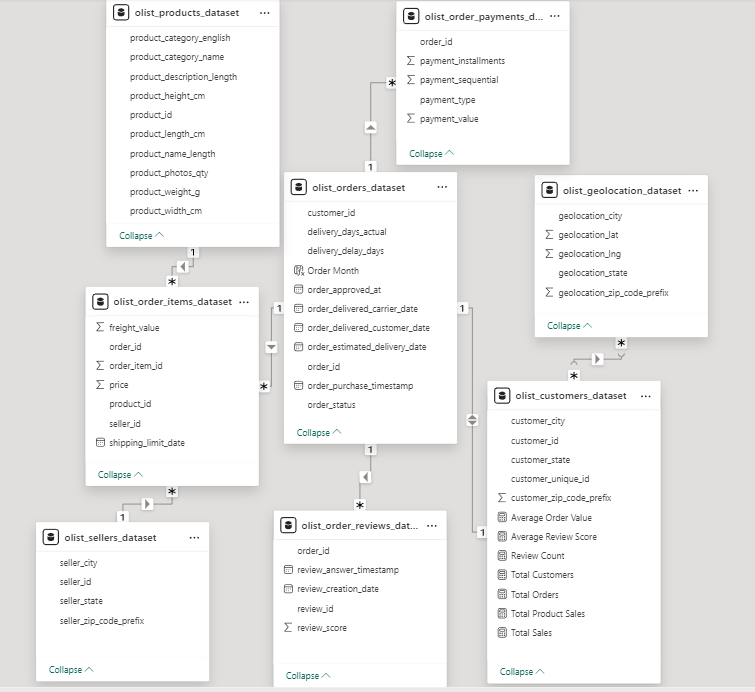

## Main Table

### `olist_orders_dataset`

This is the main table in the model.

It contains order information such as:

- order ID
- customer ID
- order status
- purchase date
- delivery date
- estimated delivery date
- delivery delay

This table is important because most other tables connect to it.

---

## Other Tables

### `olist_customers_dataset`

This table contains customer information.

It includes:

- customer ID
- customer city
- customer state
- customer zip code

This table helps analyze where customers are from.

---

### `olist_order_items_dataset`

This table contains the items inside each order.

It includes:

- order ID
- product ID
- seller ID
- price
- freight value

This table is used to analyze product sales and seller performance.

---

### `olist_products_dataset`

This table contains product details.

It includes:

- product ID
- product category
- product weight
- product size
- product photos quantity

This table helps analyze sales by product category.

---

### `olist_sellers_dataset`

This table contains seller information.

It includes:

- seller ID
- seller city
- seller state
- seller zip code

This table is used to analyze sellers and their locations.

---

### `olist_order_payments_dataset`

This table contains payment information.

It includes:

- order ID
- payment type
- payment installments
- payment value

This table helps analyze how customers paid for their orders.

---

### `olist_order_reviews_dataset`

This table contains review information.

It includes:

- order ID
- review ID
- review score
- review date

This table helps analyze customer satisfaction.

---

### `olist_geolocation_dataset`

This table contains location information.

It includes:

- zip code prefix
- city
- state
- latitude
- longitude

This table is connected to the customer table using zip code prefix.

---

## Relationships

The tables are connected using key columns.

Some important relationships are:

| Table 1 | Table 2 | Description |
|---|---|---|
| Customers | Orders | One customer can have many orders |
| Orders | Order Items | One order can have many items |
| Orders | Payments | One order can have payment records |
| Orders | Reviews | One order can have a review |
| Products | Order Items | One product can appear in many orders |
| Sellers | Order Items | One seller can sell many products |
| Geolocation | Customers | One location can relate to many customers |

---

## Why It Is a Snowflake Model

This is called a snowflake model because the data is separated into different tables.

Instead of putting everything in one big table, each type of data has its own table.

For example:

- customer data is in the customer table
- product data is in the product table
- seller data is in the seller table
- payment data is in the payment table
- review data is in the review table

This makes the model more organized and easier to understand.

---

## What This Model Can Analyze

This model can be used to analyze:

- total sales
- total orders
- customer locations
- product categories
- seller performance
- payment methods
- delivery delays
- review scores

---

## Summary

The data model is built around the orders table.

Customers place orders, orders have items, items are connected to products and sellers, and orders also connect to payments and reviews.

The customer table is connected to geolocation data to show customer locations.

Overall, this model helps understand sales, customers, products, sellers, payments, reviews, and delivery performance.

# E-Commerce Sales Dashboard

## Overview

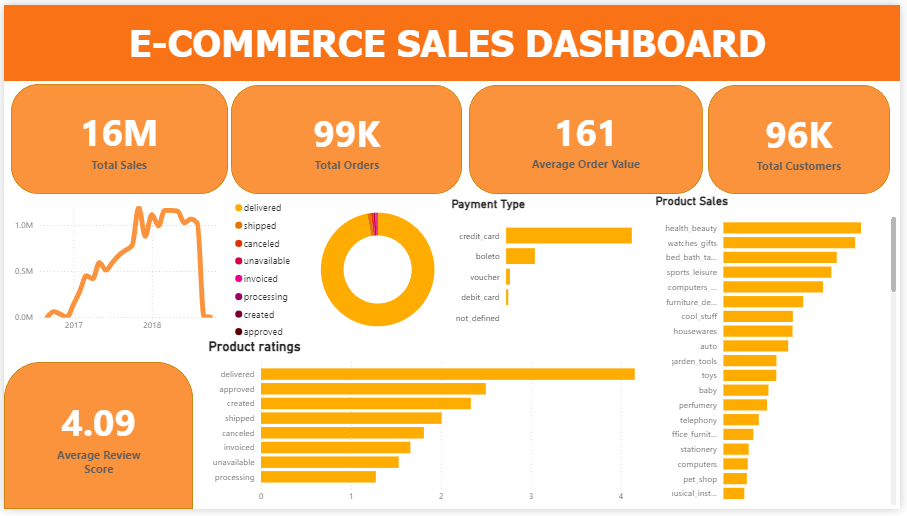

This dashboard presents a simple overview of e-commerce business performance. It shows sales, orders, customers, payment methods, product categories, and customer review performance.

The purpose of this dashboard is to help users monitor business performance and identify areas that may need improvement.

---

# KPI Cards

## 1. Total Sales

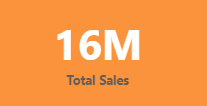

The **Total Sales** card shows the total amount paid by customers. It gives a quick view of the overall revenue generated by the business.

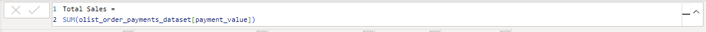

```DAX
Total Sales =
SUM(olist_order_payments_dataset[payment_value])
```

**Explanation:**  
This measure calculates the total sales by adding all customer payment values.

**Used in:**
- Total Sales card
- Sales by Month chart
- Sales by Payment Type chart

**Purpose:**  
To measure the total income from all customer payments.

---

## 2. Total Orders

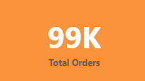

The **Total Orders** card shows the total number of orders made by customers. This helps measure the overall order volume of the business.

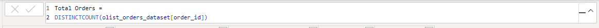

```DAX
Total Orders =
DISTINCTCOUNT(olist_orders_dataset[order_id])
```

**Explanation:**  
This measure counts the total number of unique orders in the dataset.

**Used in:**
- Total Orders card
- Orders by Status chart

**Purpose:**  
To understand how many orders were placed in the e-commerce platform.

---

## 3. Average Order Value

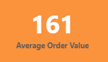

The **Average Order Value** card shows the average amount spent per order. It is calculated by dividing total sales by total orders.

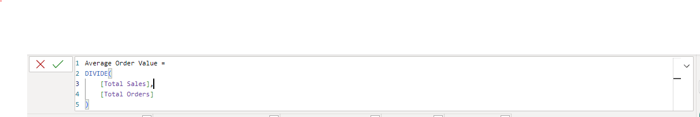

```DAX
Average Order Value =
DIVIDE(
    [Total Sales],
    [Total Orders]
)
```

**Explanation:**  
This measure calculates the average amount spent per order. It divides total sales by total orders.

**Used in:**
- Average Order Value card

**Purpose:**  
To understand how much customers spend on average for each order.

---

## 4. Total Customers

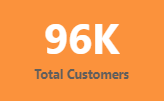

The **Total Customers** card shows the total number of unique customers. This helps measure the size of the customer base.

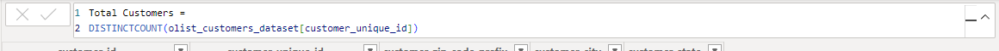

```DAX
Total Customers =
DISTINCTCOUNT(olist_customers_dataset[customer_unique_id])
```

**Explanation:**  
This measure counts the number of unique customers who made purchases.

**Used in:**
- Total Customers card

**Purpose:**  
To identify how many different customers purchased from the platform.

---

## 5. Average Review Score

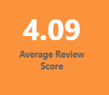

The **Average Review Score** card shows the average rating given by customers. It helps measure customer satisfaction.

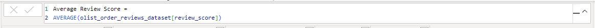

```DAX
Average Review Score =
AVERAGE(olist_order_reviews_dataset[review_score])
```

**Explanation:**  
This measure calculates the average rating given by customers.

**Used in:**
- Average Review Score card
- Average Review Score by Order Status chart

**Purpose:**  
To understand the overall satisfaction level of customers based on their reviews.

---

## 6. Total Product Sales


```DAX
Total Product Sales =
SUM(olist_order_items_dataset[price])
```

**Explanation:**  
This measure calculates the total sales value based on product item prices.

**Used in:**
- Top Product Categories by Sales chart

---


# Calculated Column Created

## Order Month Column

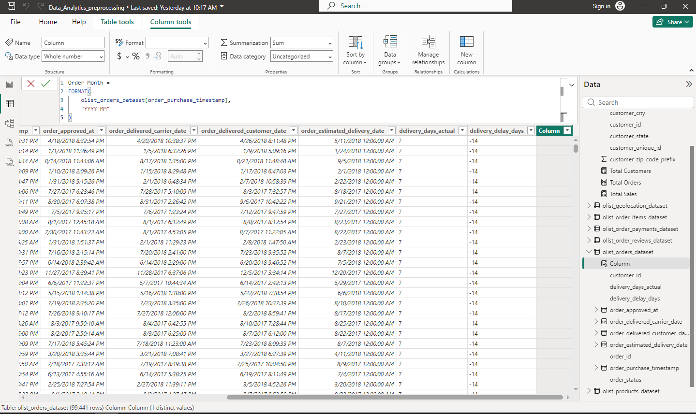

```DAX
Order Month =
DATE(
    YEAR(olist_orders_dataset[order_purchase_timestamp]),
    MONTH(olist_orders_dataset[order_purchase_timestamp]),
    1
)
```

**Explanation:**  
This calculated column groups orders by month. It is used to show sales trends over time.

**Used in:**
- Sales by Month chart

---


# Charts

## 1. Sales by Month

The **Sales by Month** line chart shows how sales change over time. It helps identify months with high or low sales performance.

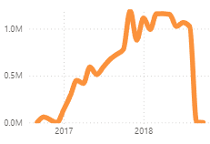

**Purpose:**  
To analyze monthly sales trends and see whether sales are increasing or decreasing.

---

## 2. Orders by Status

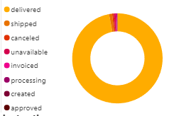

The **Orders by Status** chart shows the number of orders based on their status, such as delivered, shipped, canceled, or unavailable.

**Purpose:**  
To understand the condition of orders and identify how many orders were successfully completed or had issues.

---

## 3. Top Product Categories by Sales

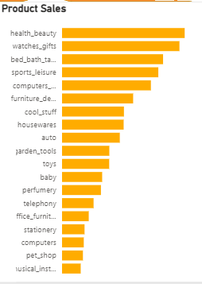

The **Top Product Categories by Sales** chart shows which product categories generated the highest sales.

**Purpose:**  
To identify the best-performing product categories and understand which products contribute most to revenue.

---

## 4. Sales by Payment Type

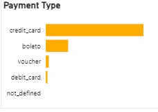

The **Sales by Payment Type** chart shows how much sales came from each payment method, such as credit card, boleto, voucher, or debit card.

**Purpose:**  
To understand which payment methods customers use the most when making purchases.

---

## 5. Average Review Score by Order Status

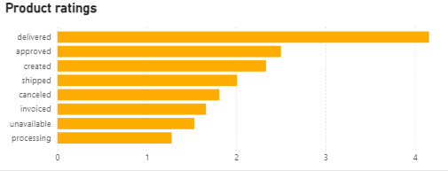

The **Average Review Score by Order Status** chart shows the average customer rating for each order status.

**Purpose:**  
To analyze how order status affects customer satisfaction. For example, delivered orders may receive higher ratings, while canceled or unavailable orders may receive lower ratings.

---


